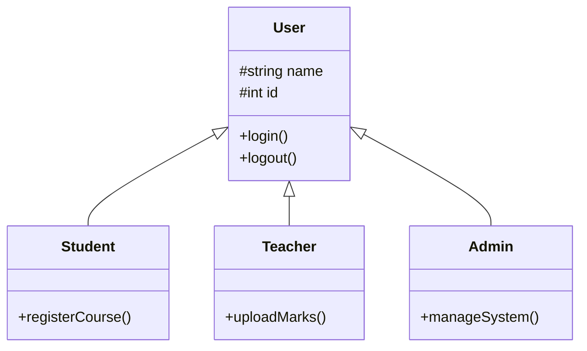

# Assignment-3

A small C++ program that demonstrates single inheritance and destructor order for a simple school system with **User**, **Student**, **Teacher**, and **Admin** classes. Each object logs its lifecycle (construction, actions, and destruction) to the console to make ownership and cleanup visible.

## Project Structure
Paths below are relative to the repository root (this README's directory).
- `Assignment-3/Assignment-3.cpp` - main program source
- `Assignment-3/Assignment-3.vcxproj` - Visual Studio project file
- `Assignment-3/Assignment-3.vcxproj.filters` - Visual Studio filters

## Prerequisites
- Any modern C++ compiler (e.g., `g++`, `clang++`, or `MSVC`)
- Optional: Visual Studio to use the provided project file

## Build & Run
You can start from the repository root (the directory containing this README).

### Using g++ (from repository root)
```bash
cd Assignment-3
g++ Assignment-3.cpp -o school-system
./school-system
```

### Using Visual Studio
1. From the repository root, open `Assignment-3/Assignment-3.vcxproj`.
2. Build the solution.
3. Run the produced executable from Visual Studio or the output directory.

## Program Flow
1. Creates one `Student`, one `Teacher`, and one `Admin`, each derived from `User`.
2. Calls `login()` plus a role-specific action (`registerCourse`, `uploadMarks`, `manageSystem`).
3. Exiting scope triggers destructors in reverse creation order, illustrating proper cleanup.

## Class Diagram (UML)

> Note: Mermaid rendering is required to view the diagram below. If Mermaid is not supported, refer to the textual hierarchy that follows.



Textual hierarchy (fallback):
```
User
├─ Student
├─ Teacher
└─ Admin
```

## Sample Output
```
=== STARTING SYSTEM SIMULATION ===

--- Creating Objects ---
[User Constructor] Created User: Zamad (ID: 1001)
  -> [Student Constructor] Initialized Student specifics.
Zamad logged in.
Action: Zamad is registering for a course.

[User Constructor] Created User: Prof. Ahmed (ID: 2001)
  -> [Teacher Constructor] Initialized Teacher specifics.
Prof. Ahmed logged in.
Action: Prof. Ahmed is uploading marks.

[User Constructor] Created User: SysAdmin (ID: 9999)
  -> [Admin Constructor] Initialized Admin specifics.
SysAdmin logged in.
Action: SysAdmin is managing system configurations.

--- Exiting Scope (Destructors Triggered) ---
  -> [Admin Destructor] Cleaning up Admin resources.
[User Destructor] Cleaning up User: SysAdmin
  -> [Teacher Destructor] Cleaning up Teacher resources.
[User Destructor] Cleaning up User: Prof. Ahmed
  -> [Student Destructor] Cleaning up Student resources.
[User Destructor] Cleaning up User: Zamad

=== END OF PROGRAM ===
```
